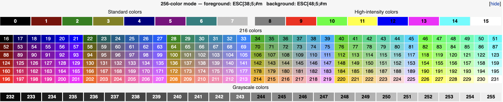

# Palette

If you’ve ever done any programming in Java, or other command line type interfaces, you’ve likely printed text to a console at some point. By default, the output you see is just plain old black text on a white background, appearing all at once.

Thankfully there is another way! With something known as Palette, we have more control on what the output looks like. Palette is a Library in Java that allow a programmer to style the output in console and text based applications. Whether providing needed functionality, like differentiating the categories of output with color, or just adding some flair, Palette are easy and fun to include in your programs.

## ANSI Colors
</img>